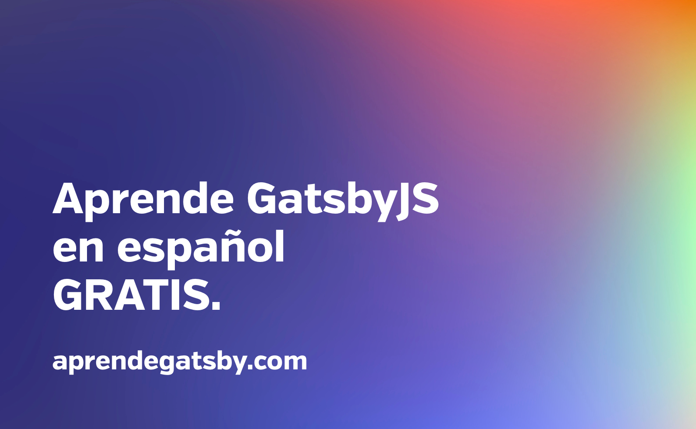

## `npx gatsby new hola-mundo` 👋

### Únete a la revolución en desarrollo web y aprende como crear sitios web y apps con Gatsby, React y GraphQL

UPDATE: La primera versión del curso! puedes ir a verlo aquí! 👉 <a href="https://hhg.link/intro-gatsby" target="_blank">hhg.link/intro-gatsby</a>

Apuntate aqui para recibir actualizaciones y nuevos videos 👉 <a href="https://hhg.link/curso-gatsby" target="_blank">aprendegatsby.com</a>

Estoy muy contento en presentarte mi ultimo proyecto!. Una serie de video-tutoriales cortos al estilo [Egghead](https://egghead.io) donde te enseño desde las herramientas basicas que forman Gatsby hasta como crear paginas programaticamente a partir de contenido dinamico.

[Gatsby](https://gatsbyjs.org) no es solo un framework para hacer paginas web estaticas, nos ayuda tambien a general aplicaciones web muy potentes y muy rapidas.

### Al final de curso seras un experto en:

- Las herramientas basicas que forman Gatsby y te guio en la configuracion de tu entorno de desarrollo.
- Desarrollo desde cero hasta subida a produccion (deploy)
- Exploraremos librerias como `Typography.js` y estilar con tecnologias CSS-in-JS
- Extraer data desde varias fuentes de datos usando GraphQL
- Crear paginas programaticamente para tus blog posts
- y mucho mas!!

### Para quien es este curso?

Tanto para programadores que estan iniciando su carrera como para los que llevamos unos cuantos años que quieren aprender a usar Gatsby y crear p’aginas web que sean rapidas pro defecto.

Para empezar necesitas saber JavaScript - No es un curso de Introduccion a JavaScript. Aprenderas mientras construyes. En cada seccion te explico en detalle como, que y cuando usar las soluciones presentadas.

Gatsby tiene muchas posibilidades dentro del desarrollo web. En este curso nos enfocaremos en las piezas principales y claves para que formes una base solida y estable para aprender casos mas complejos.

### Realmente es GRATIS?

Si, lo has leido bien. GRATIS.
Los he hecho gratis como agradecimiento a la comunidad que tanto usamos y que nos enseña todos los dias. Es una forma de Devolver el favor :)

### Videos cortos, pero al grano

Estoy dedicado a respetar tu tiempo. Esto significa que el curso va al grano y brinda conocimiento que **puedes usar hoy**. No encontrarás un curso aburrido de 8 horas, sino una gran cantidad de videos pequeños que contienen más información en una fracción del tiempo.

Aqui te dejo el primero de los videos para que te hagas una idea del formato en el que esta el curso. Espero que te guste y nos vemos pronto!

<iframe
  width="100%"
  height="400"
  src="https://www.youtube.com/embed/81jNpzPuQ7g"
  frameBorder={0}
  allow="accelerometer; autoplay; encrypted-media; gyroscope; picture-in-picture"
  allowFullScreen
></iframe>

No te lo Pierdas!! 👉 <a href="https://hhg.link/curso-gatsby" target="_blank">aprendegatsby.com</a>

