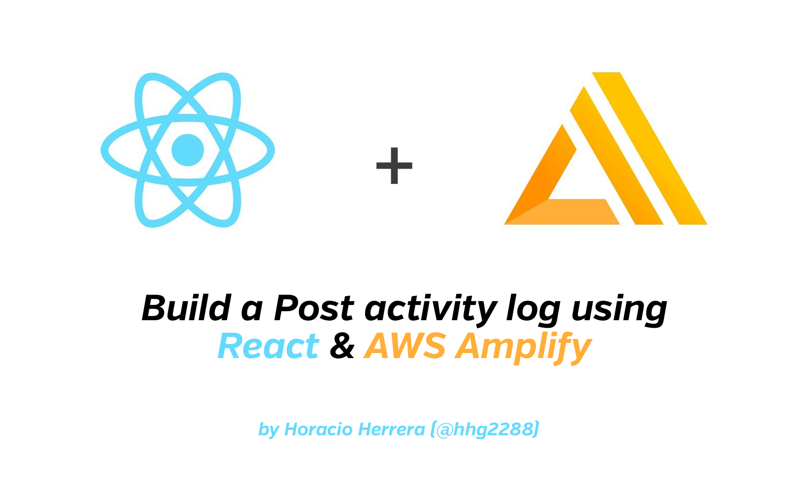
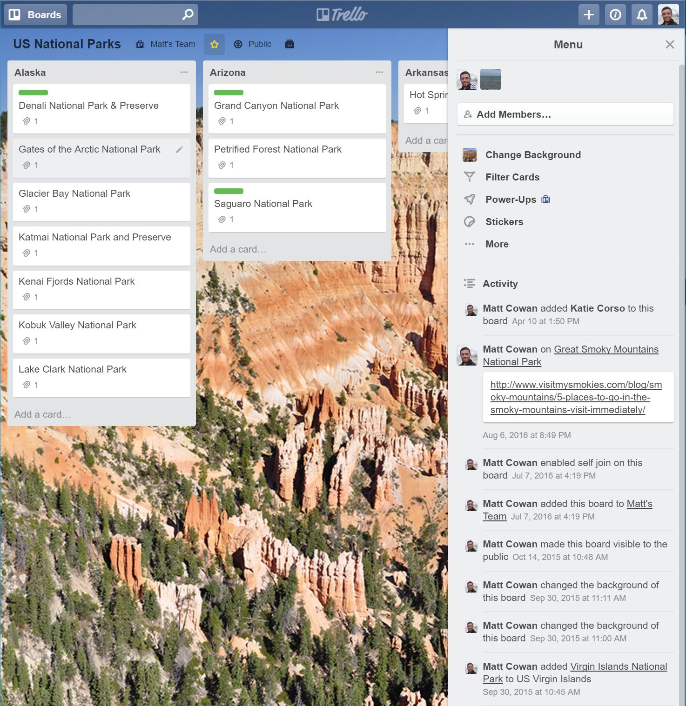
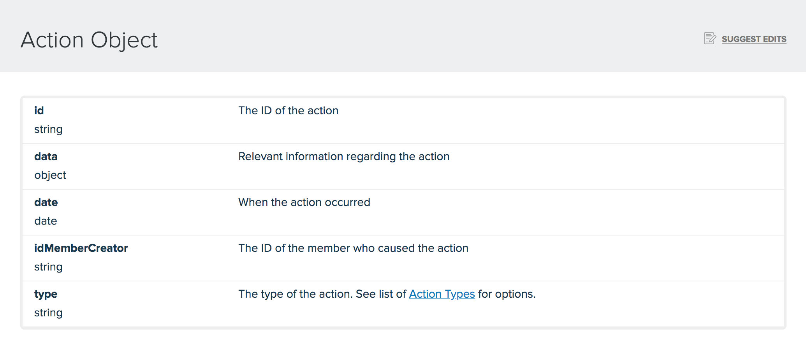

import { BlockQuote, List } from 'gatsby-theme-horacioh'
import { Link } from 'gatsby'



<BlockQuote>

This is a series of posts where I [document my learnings](/document-your-learnings/) & findings while building two webapps for two family businesses

</BlockQuote>

#### TL;DR. checkout [this example repo](https://github.com/horacioh/posts-activity-amplify-example) on how to achieve this yusing AWS Amplify & React. Any feedback is welcome!

---

At [Hamerlin](https://hamerlin.com), as in any other company, data is crucial. having a goto place to find all the information about clients & reports is essential to the business. Not only that, but knowing who and when update, create and delete data.

We've seen this in many of the services we use in our daily lives, eg: Trello or Google Drive. Because is something usually users expects, I naively thought that it was something ready to plugin in place and start using it, but it doesn't. In fact, It's more complex that you might think. To illustrate a real world example, let's take a look at how Trello approach this:

## How Trello stores User's activity data

they call them [Actions](https://developers.trello.com/reference#actions), and as in there website, here's their definition:

<BlockQuote>

Actions are generated whenever an action occurs in Trello. For instance, when a user deletes a card, a deleteCard action is generated and includes information about the deleted card, the list the card was in, the board the card was on, the user that deleted the card, and the idObject of the action.

</BlockQuote>

_Trello Actions in the activity feed in the board sidebar_

_Trello Actions in a card's activity feed_

Basically they not only store all the changes that happened, but they identify changes [**by type**](https://developers.trello.com/reference#section-all-action-types) and store it accordingly, including a bunch of data related to the modified resource. This is important for them because they not only list the generic changes, but they also include links to the resource, related data like the board was in, the column. the user, etc.

_Action Object_

To be honest, this approach is amazing but is TOO complex to what (I think?) we can achieve in just a couple of hours. I want to build this app incrementally, so I will present you my fisrt approach and then we can talk about the ideal escenario.

---

## Let's build our Activity log

First of all, make sure you have an Amplify + React project setup [ready to start](https://aws-amplify.github.io/docs/js/start). you can use whatever entity you want, in this cas I will use a Post type for the sake of simplicity.

### Let's define our schema

As I said before, this is the simplest approach to get the job done. it may be better ways to do this, but we are Lean developers and we can improve this in another iteration :)

** The goal is to store the history of changes of each post.**

the fields I want to store per-change are:

<List>

- the post ID
- the author of the change
- a timestamp of the change
- the action type
- and the resulted post after the change

</List>

after running `amplify add api`, we can edit our `schema.graphql`. It should look something like this:

```graphql
type Post @model {
  id: ID!
  title: String!
  slug: String!
  content: String!
}

type PostHistory @model @searchable {
  id: ID!
  postId: ID!
  creator: String!
  createdAt: String
  action: PostAction
  payload: HistoryPayload
}

enum PostAction {
  CREATED
  UPDATED
  DELETED
}

type HistoryPayload {
  title: String
  slug: String
  content: String
}
```

Then we are ready to run `amplify push` and start testing our implementation. But first let me explain my approach here:

The idea is that everytime a Post is being either `CREATED`, `UPDATED` OR `DELETED`, I also create a new `PostHistory` that stores data from the previews operation. The cool thing is that because we are using GraphQL, we know before hand which operation the user wants to execute, so it's _easier_ to populate the `PostAction` enum from it in our code. Also we have all the possible queries & mutations generated by the Amplify CLI 😉

### Create a post using React

First we need to create our [`CreatePost` component](https://github.com/horacioh/posts-activity-amplify-example/blob/master/src/components/CreatePost.js) with a simple form and the important part: the `handleSubmit`.

Let's focus on the `handleSubmit` method:

```jsx

const handleSubmit = async e => {
  e.preventDefault();
  const date = new Date();
  const input = { title, content, slug };

  const { data } = await API.graphql(graphqlOperation(createPost, { input }));
  if (data.createPost.id) {
    const postHistory = await API.graphql(
      graphqlOperation(createPostHistory, {
        input: {
          postId: data.createPost.id,
          creator: "horacio",
          createdAt: date,
          action: "CREATED",
          payload: {
            title: data.createPost.title,
            slug: data.createPost.slug,
            content: data.createPost.content
          }
        }
      })
    );
    history.push(`/post/${data.createPost.id}`);
  }
}

```

As you can see, I'm creating a post as you normally will do with the Amplify's `API` module. After the creation, I take the result and create a new `PostHistory` using the generated `createPostHistory` mutation. You should see something like this:

<iframe width="100%" height="400" src="https://www.youtube.com/embed/HD-s0yQFU7I" frameBorder={0} allow="accelerometer; autoplay; encrypted-media; gyroscope; picture-in-picture" allowFullScreen></iframe>

You can also checkout how the [UpdatePost component](https://github.com/horacioh/posts-activity-amplify-example/blob/master/src/components/UpdatePost.js) works, it's pretty similar to the creation.

---

## Some considerations

Of course this is a really simplistic example, and it has a couple of limitations that I should consider for future iterations:

<List>

- Currently the `creator` attribute is a string, but eventually I would like this to be a connection to the actual user that's logged in for each operation, this will let me not only get access to more data from the user, but also flexible for changes on the user's data.
- Now I now this is a more `REST` approach, we are making 2 round trips to the server for one single user's operation. In the future, I would like this to be automatic, and maybe call a Lambda function from any DynamoDB event? or maybe a [pipeline resolver](https://docs.aws.amazon.com/appsync/latest/devguide/pipeline-resolvers.html) could work?
- if you see the [`Post.js` component](https://github.com/horacioh/posts-activity-amplify-example/blob/master/src/components/Post.js), you see that I create aldo 2 queries to get the data for the frontend. This is OK, but maybe I would like to change my schema to something like this:

</List>

```graphql

type Post @model {
  id: ID!
  title: String!
  slug: String!
  content: String!
  actions: [PostHistory] # <== THIS!!
}

```

having the specific actions inside the specific Post type I think it's more ellegant. I actually don't know how difficult this may be, but it looks cool right?

---

You can checkout the final result on [this repo](https://github.com/horacioh/posts-activity-amplify-example) and let me know any feedback!.

I'm learning a lot doing this examples and hope you can take some knowledge from it too!. If you thought any other way to solve this problem or know how to make this example better **please let me know!**


