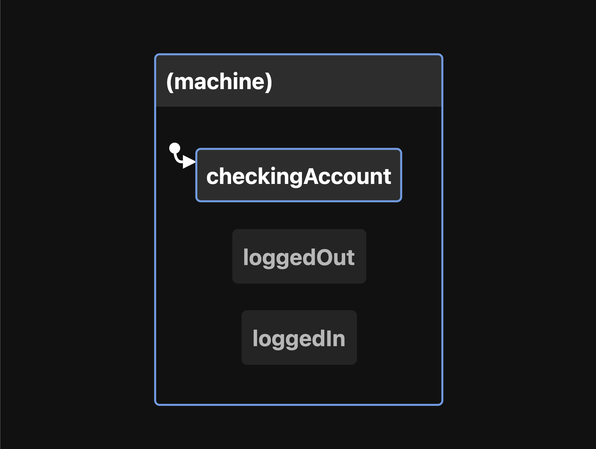
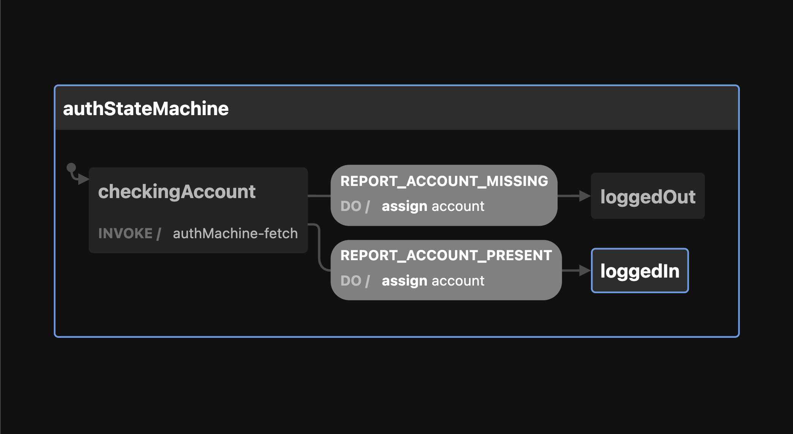

_Photo by <a href="https://unsplash.com/@foxxmd?utm_source=unsplash&utm_medium=referral&utm_content=creditCopyText">Matt Duncan</a> on <a href="https://unsplash.com/s/photos/journey?utm_source=unsplash&utm_medium=referral&utm_content=creditCopyText">Unsplash</a>_

> TLDR: checkout the final machine [here](https://stately.ai/viz/a7bc3ca4-8db6-4585-840f-8707fcdfdafd)

> UPDATE: I rename the `callback` to `send` as a suggestion from [Erik](https://twitter.com/erikras/status/1456498973909430275) and I mention some resources created by [Matt Pocock](https://twitter.com/mpocock1)

---

One of the key libraries we use to develop the [Mintter](https://mintter.com) app is [XState](https://xstate.js.org/). In this short post, I want to show you how are we using it to check if a user is logged in or logged out, and change the app behaviour depending on the result.

## What is XState?

> XState is a library for creating, interpreting, and executing finite state machines and statecharts, as well as managing invocations of those machines as actors

I took this definition from the official website, and if you are not familiar with the concepts _finite state machines_ or _actors_ don't worry, it's not as complex as it sounds!

You can expand your knowledge about it in the official documentation, but in short, XState helps you define in a declarative way all the business logic of your application, making it easy to intercept, interact and respond to it with full confidence. Honestly, is one of the most important discoveries I've personally made on programming recently.

## Why State Machines?

Not only helps you define your business logic in a more concise way, but also helps you communicate better with designers and other non-developer teammates, making your product more robust and future-proof. You should definitely give it a try!

## The Auth flow

_if you don't have much time to read all the explanation, you can checkout the machine [here](https://stately.ai/viz/a7bc3ca4-8db6-4585-840f-8707fcdfdafd)_

In [Mintter](https://mintter.com), everytime a user opens the desktop app, we need to check if an account is present on the machine or not. Let's start by defining all the requirements we need to implement:

- when the user opens the app, we need to check if there's an account available
- if the account is available, we can show the app view
- if the account is NOT available, we need to show the onboarding view to create an account

In this post we are just covering this part of the flow, the other parts will be covered in future blog posts!

From the top list you can see that we defined 3 **states** in which the user can be at any point in time. let's see the list again:

- when the user opens the app, we need to **check** if there's an account available
- if the account is available, we can **show the app view**
- if the account is NOT available, we need to **show the onboarding view** to create an account

we can then rename this states to something more meaningful like:

- checkingAccount
- loggedIn
- loggedOut

So far so good!, let's also visualize this with a diagram:



and here's the code that creates this diagram:

```typescript
import { createModel } from "xstate/lib/model"

const authModel = createModel({
  account: undefined as string | undefined,
})

const authMachine = authModel.createMachine({
  initial: "checkingAccount",
  states: {
    checkingAccount: {},
    loggedIn: {},
    loggedOut: {},
  },
})
```

By the way, what we are creating is a **machine**, more specifically: a Finite State Machine, because we are defining a finite number of states that this machine can be and transition to. (read more about it [here](https://xstate.js.org/docs/about/concepts.html#finite-state-machines))

In order to transition from one state to another, we need to define a couple of **events**. The machine can receive as many events as you like, but each state needs to define which events wants to respond to.

For this machine, we want to transition from `checkingAccount` to `loggedIn` if the account is present, we can call this event `REPORT_ACCOUNT_PRESENT`. if the account is not present, then we want to transition to `loggedOut`: we can call this event `REPORT_ACCOUNT_MISSING`. We also need `LOG_IN` and `LOG_OUT` events for the basic actions from the app. Let's add the events to our model:

```typescript
import { createModel } from "xstate/lib/model"

const authModel = createModel(
  {
    account: undefined as string | undefined,
  },
  {
    events: {
      LOGGED_IN: (account: string) => ({ account }),
      LOGGED_OUT: () => ({}),
      REPORT_ACCOUNT_PRESENT: (account: string) => ({ account }),
      REPORT_ACCOUNT_MISSING: () => ({}),
    },
  }
)

const authMachine = authModel.createMachine({
  initial: "checkingAccount",
  states: {
    checkingAccount: {},
    loggedIn: {},
    loggedOut: {},
  },
})
```

> I'm using the `createModel` utility because it gives better type safety when using the machine. you can use the common `createMachine` if you like too!

### Invoking another Actor

For this Auth flow, we want to inmediately make a request to the backend and check if the user is available or not, and a common and recommended way to do so is by [**invoking a Service or Actor**](https://xstate.js.org/docs/guides/communication.html#invoking-services). Invoking a service is not different from calling an asynchronous function to get some data.

As you can see in the above snippet, we are starting our machine on the `checkingAccount` state, this means that we need to invoke our call to the API inside that state like so:

```typescript
// ...

const authMachine = authModel.createMachine({
  initial: "checkingAccount",
  states: {
    checkingAccount: {
      invoke: {
        id: "authMachine-fetch",
        src: "fetchAccount",
      },
    },
    loggedIn: {},
    loggedOut: {},
  },
})
```

The `fetchAccount` service or Actor will be executed right after the machine enters the `checkingAccount` state. It is recommended to define your services and actions inside the machine as strings, and implement them in the second parameter of the `createMachine` function or by extending the machine with a `withConfig` call (see more [here](https://xstate.js.org/docs/guides/machines.html#extending-machines)). Let's implement our actor now:

```typescript
// ...

const authMachine = authModel.createMachine(
  {
    initial: "checkingAccount",
    states: {
      checkingAccount: {
        invoke: {
          id: "authMachine-fetch",
          src: "fetchAccount",
        },
      },
      loggedIn: {},
      loggedOut: {},
    },
  },
  {
    services: {
      fetchAccount: () => (send) => {
        return getAccount()
          .then(function (info) {
            send({ type: "REPORT_ACCOUNT_PRESENT", account })
          })
          .catch(function (err) {
            send("REPORT_ACCOUNT_MISSING")
          })
      },
    },
  }
)

function getAccount() {
  return Promise.resolve("THE ACCOUNT")
}
```

Let's talk about the actual implementation of `fetchAccount`. As you can see is a curried function, the first function gets as parameters the machine's context and the event, but for this actor we don't need those so we avoid them. the second function takes to arguments too, the first one is a `send` and the second one is an event listener called `onReceive`

- `send` let you send events to the parent machine
- `onReceive` let you listen to events sent to the parent

In our machine, the _parent_ is the actual auth machine we are defining, since this is all defined from the actor perspective (the `fetchAccount` function). having access to this `send` is what we need to transition to the appropiate states depending on the request result! As you can see in the implementation, we are calling the `send` passing the appropiate event based on the `fetchAccount` result.

> If you want to learn more about the Invoked Callback pattern, you can checkout [this post](https://dev.to/mpocock1/xstate-why-i-love-invoked-callbacks-2f6i) from [Matt Pocock](https://twitter.com/mpocock1)

and that's it!, with this machine in place, we can then render the appropiate components based on the current state in which the machine is in, feeling very confident we are not going to get any weird errors or wrong renderings.

Or course this is a very small subset of all the machines and events we implement in our app, I will continue sharing more and more about how XState is helping us building our app with confidence and ease.

Here's the final Diagram and code. You can also play and fork this machine in the [Stately registry](https://stately.ai/viz/a7bc3ca4-8db6-4585-840f-8707fcdfdafd) (feel free to like it too!). Here's also a [very simple implementation of the machine](https://codesandbox.io/s/auth-state-machine-with-xstate-and-react-dqjmo) in a React Application.



```typescript
import { createModel } from "xstate/lib/model"

export const authModel = createModel(
  {
    account: undefined as string | undefined,
  },
  {
    events: {
      LOGGED_IN: (account: string) => ({ account }),
      LOGGED_OUT: () => ({}),
      REPORT_ACCOUNT_PRESENT: (account: string) => ({ account }),
      REPORT_ACCOUNT_MISSING: () => ({}),
    },
  }
)

export const authStateMachine = authModel.createMachine(
  {
    id: "authStateMachine",
    context: authModel.initialContext,
    initial: "checkingAccount",
    states: {
      checkingAccount: {
        invoke: {
          id: "authMachine-fetch",
          src: "fetchAccount",
        },
        on: {
          REPORT_ACCOUNT_PRESENT: {
            target: "loggedIn",
            actions: [
              authModel.assign({
                account: (_, ev) => ev.account,
              }),
            ],
          },
          REPORT_ACCOUNT_MISSING: {
            target: "loggedOut",
            actions: [
              authModel.assign({
                account: undefined,
              }),
            ],
          },
        },
      },
      loggedIn: {},
      loggedOut: {},
    },
  },
  {
    services: {
      fetchAccount: () => (send) => {
        return getAccount()
          .then(function (account) {
            send({ type: "REPORT_ACCOUNT_PRESENT", account })
          })
          .catch(function (err) {
            send("REPORT_ACCOUNT_MISSING")
          })
      },
    },
  }
)

function getAccount() {
  return Promise.resolve("THE ACCOUNT")
}
```

---

Thanks for reading until here!, if you have any comments or feedback please reach out via [twitter](https://twitter.com/hhg2288)!
