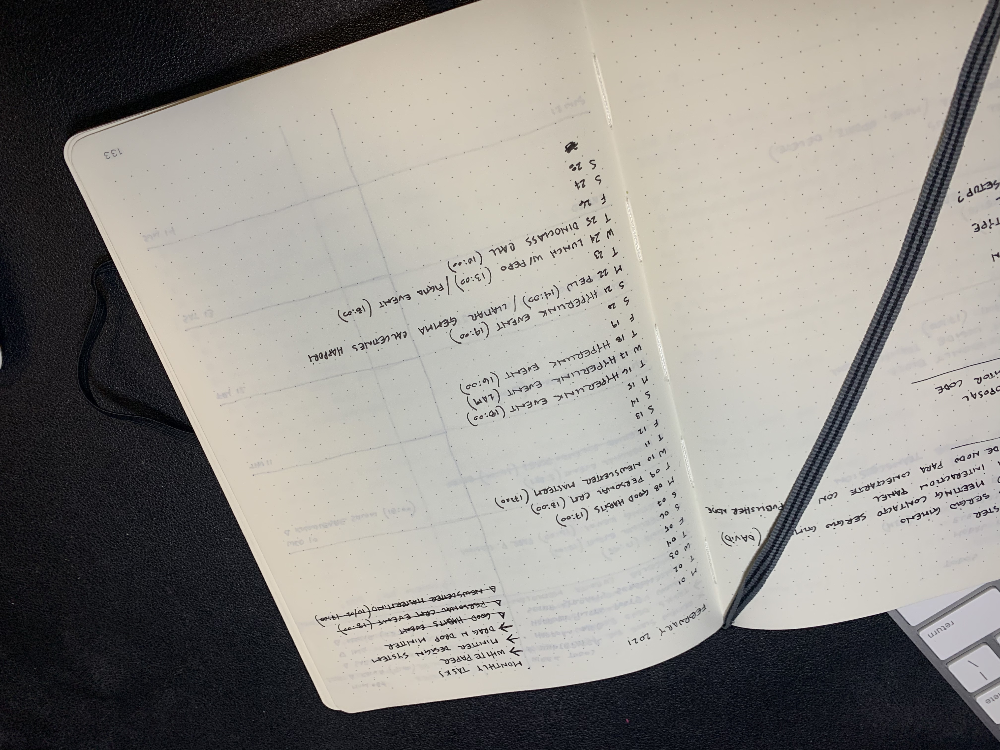
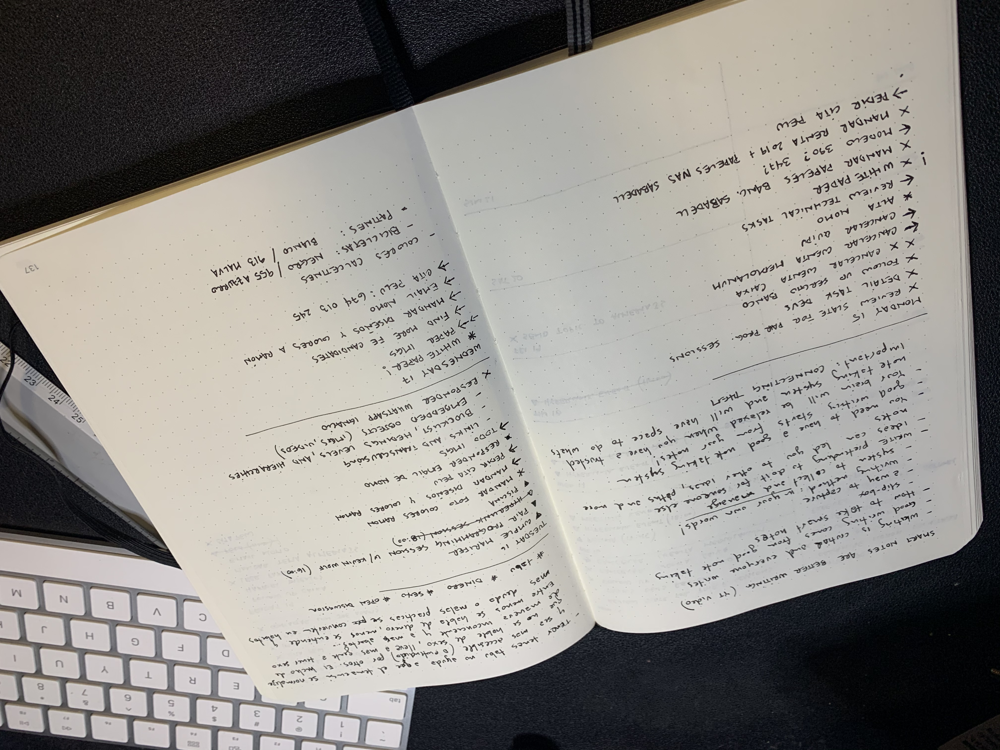

## TLDR;

- create a week log
- review current month activity page
- review last week missed tasks and add them to the next one if relevant
- review my digital calendars and shared calendars
- review family's calendar (activities I'm involved)
- make simple tasks I missed from past week (send emails, paperwork or similar)
- ask my wife if there's things missing in our digital family calendar for next week (better double check!)
- read something and go to bed ;)

---

I have a routine every sunday night to organize my whole week using my [Bullet Journal](https://bulletjournal.com/).

<Tweet tweetLink="hhg2288/status/1363599084163072002" />

I'm not particurally the most organized person, but maybe my whole process can help others get some ideas on how to organize their daily tasks using non-digital tools. But before getting into the details, let's respond some common questions:

## Why not digital?

Good question.

For me writing by hand helps me connect and remember more things. Sometines where I wrote something and/or the context were I was while writing is the missing link between my silly brain and the thoughts I had. Every brain works in different ways, mine seems to work better when I combine ideas/thoughts with spacial environments and activities.

Another thing that helps me write things by hand, is to release that concept/idea from my head, and free my brain from trying to keep it somewhere. I know that if I wrote it in my BuJo, I'm not forgetting it. I think this is more a feature of having an external process than not doing it digitally 🤷🏼‍♂️.

## Why Bullet Journal?

I honestly don't know.

I've tried a bunch of techniques and processes, but maybe I kept using Bullet Journal because it's very simple and customizable, and I was doing it with my wife too (both separate BuJos). I think the results of using BuJo by yourself are very clear from the start, but **syncing activities with someone else makes the experience much more exciting and adictive for us**. We were like a f\*\*\*\*ng swiss watch!.

Really the only thing that made the experience much better was to sync our calendars every week, every sunday. It was a habit for us, to the point that if we missed it, that week both felt lost and something wrong happened.

> Making this syncing activity a habit made a huge difference in our daily lives.

I've been using BuJos for about 4-5 years, I have stopped and started many times, and always feel that need to use it every day, a feeling that I have never had with a digital tool or anything like that. I don't go anywhere without it (except for saturdays which is our family day)

## The process

This is what I do. By no means I want you to think this is the best and only way to do it. Read it, take ideas and create your own processes:

1. **create a week grid**: as simple as the picture in the tweet above. there are millions of ideas in Pinterest if you search for [Weekly planner Bullet Journal](https://www.pinterest.es/search/pins/?rs=ac&len=2&q=weekly%20planner%20bullet%20journal&eq=Weekly%20planner%20Bullet%20Journal&etslf=2660&term_meta[]=weekly%7Cautocomplete%7C0&term_meta[]=planner%7Cautocomplete%7C0&term_meta[]=bullet%7Cautocomplete%7C0&term_meta[]=journal%7Cautocomplete%7C0)

2. **Review current month activity page**: I check all the monthly activities I added before and bring them to next week. (learn more the monthly log and all the BuJo's pieces [here](https://bulletjournal.com/pages/learn))

3. **Review last week missed tasks**: ...and add them to the next one if relevant.

4. **Review digital calendars and shared calendars**: those are mostly business meetings and other social online activities.

5. **Review family's calendar**: **A MUST** if you don't want to miss family-points foolishly.
6. **make simple tasks I missed from past week**: little stuff like send emails, paperwork or similar that are pointless to move them forward to next week.
7. **Ask my wife if there's things missing in our digital family calendar for next week**: another must if you care about your family-points.

## Consistency is the real key

I'm sure you already know this. IMHO this is the hardest part of anything meaningful you want to accomplish. Believe me, I have countless of examples about projects and things I started that are not finished.

What helps me to avoid feeling super bad about it is this:

- You do You. your process is yours and nobody else. if you need 10x to do something than others, **THAT'S FINE**.
- Break tasks as small as you need them. is better to accomplish small things in a consisten way than bigger things not-so-consistent, with a huge effort and energy.

## Conclusions & ideas

- find what helps your brain make connections and trails to what you need to accomplish, it could be writing by hand like me or something else.
- Have no more than two places where you write things down. Havimg more places could make things worse.
- **BE CONSISTENT**. Unfortunately, there's no shortcuts for this one.
- If possible, involve family or someone close in the process. (I'm trying to convince my wife to go back and sync both our journals as we used to do a year back)
- apart from my BuJo, I also use [Foam](https://foambubble.github.io/foam/), which is a digital tool yes, but I use it for other things like an inbox for everything I find on the internet, learning materials, content notes and other things. you can find it [here](https://horacioh.github.io/braindump/) if you are curious. I'm still figuring out how Foam fits for me tho...

## What's your process?

thanks for reading!, I'm curious about your process: What do you do? how often do you organize your work tasks? personal tasks? Have you tried something similar?

If you read until here, please send me a tweet with this emoji -> 🌱. and if you can, please let me know what was thing that like you the most about it and how are you planning on applying it on your daily life!

Happy start of the week! 💪🏼
